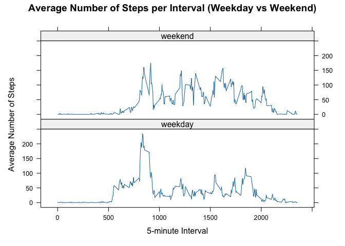

## Loading and preprocessing the data


```r
unzip("activity.zip")
activity_data <- read.csv("activity.csv")
```

## What is mean total number of steps taken per day?

Aggregate steps by date to find total steps per day (NA ignored).


```r
total_steps_per_day <- tapply(activity_data$steps, activity_data$date, sum, na.rm = TRUE)
total_steps_per_day
```

```
## 2012-10-01 2012-10-02 2012-10-03 2012-10-04 2012-10-05 2012-10-06 2012-10-07 2012-10-08 
##          0        126      11352      12116      13294      15420      11015          0 
## 2012-10-09 2012-10-10 2012-10-11 2012-10-12 2012-10-13 2012-10-14 2012-10-15 2012-10-16 
##      12811       9900      10304      17382      12426      15098      10139      15084 
## 2012-10-17 2012-10-18 2012-10-19 2012-10-20 2012-10-21 2012-10-22 2012-10-23 2012-10-24 
##      13452      10056      11829      10395       8821      13460       8918       8355 
## 2012-10-25 2012-10-26 2012-10-27 2012-10-28 2012-10-29 2012-10-30 2012-10-31 2012-11-01 
##       2492       6778      10119      11458       5018       9819      15414          0 
## 2012-11-02 2012-11-03 2012-11-04 2012-11-05 2012-11-06 2012-11-07 2012-11-08 2012-11-09 
##      10600      10571          0      10439       8334      12883       3219          0 
## 2012-11-10 2012-11-11 2012-11-12 2012-11-13 2012-11-14 2012-11-15 2012-11-16 2012-11-17 
##          0      12608      10765       7336          0         41       5441      14339 
## 2012-11-18 2012-11-19 2012-11-20 2012-11-21 2012-11-22 2012-11-23 2012-11-24 2012-11-25 
##      15110       8841       4472      12787      20427      21194      14478      11834 
## 2012-11-26 2012-11-27 2012-11-28 2012-11-29 2012-11-30 
##      11162      13646      10183       7047          0
```

Plot a histogram of total steps per day.


```r
hist(total_steps_per_day, main = "Total Steps per Day", xlab = "Total Steps", breaks = 20)
```

<!-- -->

Calculate the mean and the median of these daily totals (NA ignored).


```r
# mean
mean_steps_per_day <- mean(total_steps_per_day, na.rm = TRUE)
# median
median_steps_per_day <- median(total_steps_per_day, na.rm = TRUE)

mean_steps_per_day
```

```
## [1] 9354.23
```

```r
median_steps_per_day
```

```
## [1] 10395
```

## What is the average daily activity pattern?

Time series plot of the average number of steps taken.


```r
average_steps_per_interval <- tapply(activity_data$steps, activity_data$interval, mean, na.rm = TRUE)
plot(
    unique(activity_data$interval),
    average_steps_per_interval,
    type = "l",
    xlab = "5-minute Interval",
    ylab = "Average Number of Steps", 
    main = "Average Number of Steps per Interval"
)
```

<!-- -->

The 5-minute interval that, on average, contains the maximum number of steps.


```r
max_interval <- which.max(average_steps_per_interval)
interval_with_max_steps <- names(max_interval)
interval_with_max_steps
```

```
## [1] "835"
```

## Imputing missing values

Calculate total number of missing values


```r
total_missing_values <- sum(is.na(activity_data$steps))
total_missing_values
```

```
## [1] 2304
```

Use the mean for each 5-minute interval to fill in the missing values.


```r
# Calculate the mean for each 5-minute interval
average_steps_per_interval <- tapply(activity_data$steps, activity_data$interval, mean, na.rm = TRUE)

# Create a new dataset with the missing data filled in
imputed_data <- activity_data
for (i in 1:nrow(imputed_data)) {
  if (is.na(imputed_data$steps[i])) {
    imputed_data$steps[i] <- average_steps_per_interval[as.character(imputed_data$interval[i])]
  }
}
```

Histogram of the total number of steps taken each day and Calculate mean and median.


```r
# Calculate total steps per day for the imputed dataset
total_steps_per_day_imputed <- tapply(imputed_data$steps, imputed_data$date, sum)

# Create a histogram
hist(total_steps_per_day_imputed, main = "Total Steps per Day (Imputed)", xlab = "Total Steps", breaks = 20)
```

<!-- -->


```r
# Calculate mean and median
mean_steps_per_day_imputed <- mean(total_steps_per_day_imputed)
median_steps_per_day_imputed <- median(total_steps_per_day_imputed)

mean_steps_per_day_imputed
```

```
## [1] 10766.19
```

```r
median_steps_per_day_imputed
```

```
## [1] 10766.19
```

Comparison with the original dataset estimates.


```r
comp_results <- data.frame(
  Dataset = c("Original", "Imputed"),
  Mean = c(mean_steps_per_day, mean_steps_per_day_imputed),
  Median = c(median_steps_per_day, median_steps_per_day_imputed)
)

comp_results
```

```
##    Dataset     Mean   Median
## 1 Original  9354.23 10395.00
## 2  Imputed 10766.19 10766.19
```

## Are there differences in activity patterns between weekdays and weekends?

Create a new factor variable indicating weekday or weekend.


```r
# Convert the 'date' column to Date type
activity_data$date <- as.Date(activity_data$date, format = "%Y-%m-%d")

# Create a new factor variable for weekday/weekend
activity_data$day_type <- ifelse(
    weekdays(activity_data$date) %in% c("Saturday", "Sunday")
    , "weekend"
    , "weekday"
)
activity_data$day_type <- factor(activity_data$day_type, levels = c("weekday", "weekend"))
```

Panel plot with time series plot for weekdays and weekends.


```r
# Load required library
library(lattice)

# Calculate the average number of steps per interval for weekdays and weekends
average_steps_per_interval <- aggregate(
  steps ~ interval + day_type
  , data = activity_data
  , mean, na.rm = TRUE
)

# Panel plot using lattice
xyplot(
  steps ~ interval | day_type
  , data = average_steps_per_interval
  , type = "l"
  , layout = c(1, 2)
  , xlab = "5-minute Interval"
  , ylab = "Average Number of Steps"
  , main = "Average Number of Steps per Interval (Weekday vs Weekend)"
)
```

<!-- -->
